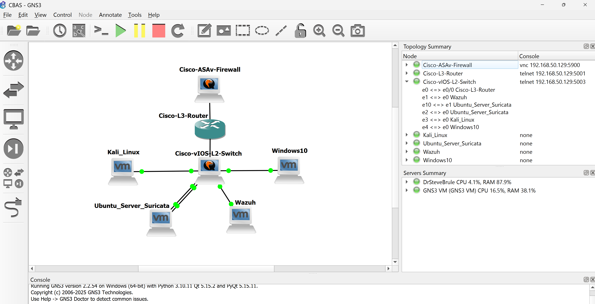

# 🛡️ SOC Home Lab: Wazuh, Suricata & GNS3 Network
   

## 📌 Project Summary
This project demonstrates a reusable virtual home network designed to simulate a real-world enterprise environment. The goal was to implement **Defense-in-Depth** by integrating network segmentation (VLANs), an Intrusion Detection System (Suricata), and an XDR/SIEM platform (Wazuh).

**Key Accomplishments:**
* Deployed a segmented network using **Cisco vIOS** (Router/Switch) and **ASAv Firewall**.
* Configured **Suricata** to sniff traffic via a SPAN port mirror.
* Ingested logs into **Wazuh** from the Router, IDS, and Endpoints.
* Validated security policies by simulating attacks (Nmap) and verifying detection.

---

## 🏗️ Network Architecture
The network was simulated using GNS3 integrated with VMware Workstation Pro.



### VLAN Configuration
I implemented network segmentation to isolate management traffic from endpoint traffic.

| VLAN ID | Name | Subnet | Description |
| :--- | :--- | :--- | :--- |
| **10** | Management | `192.168.10.0/24` | Wazuh Server & Suricata |
| **20** | Kali | `192.168.20.0/24` | Attacker Machine (Dept A) |
| **30** | Windows | `192.168.30.0/24` | Victim Machine (Dept B) |

*Full Cisco Router and Switch configurations are available in the `/configs` folder.*

---

## ⚔️ Attack & Defense Simulation
To validate the detection capabilities, I performed a live attack simulation.

### 1. The Attack
Using the Kali Linux VM (VLAN 20), I ran an aggressive Nmap scan against the Windows 10 endpoint (VLAN 30).
```bash
nmap -A 192.168.30.2
```
### 2. The Detection

Suricata detected the anomalous traffic via the SPAN port on the switch. The logs were forwarded to the Wazuh Manager, triggering the alert: **"ET SCAN Possible Nmap User-Agent Observed"**.


---

## 🔧 Challenges & Troubleshooting (Lessons Learned)

This project required significant troubleshooting. Here are the main technical hurdles I overcame:
### 1. Wazuh JSON Decoder Error

**Issue**: Suricata logs were not appearing in the Wazuh dashboard despite being forwarded. The logs showed `wazuh-analysisd ERROR Too many fields for JSON decoder`. 

**Solution**: The default decoder limit in Wazuh is 256 fields, but Suricata's `eve.json` is verbose. I modified the `internal_options.conf` file to increase the limit:
```bash
# /var/ossec/etc/internal_options.conf
analysisd.decoder_order_size=1024  # Changed from 256
```
I have since learned that custom changes should instead be made to the `/var/ossec/etc/local_internal_options.conf` file for them to persist through Wazuh upgrades.

### 2. Incompatible Switch Image (SPAN Port Failure)

**Issue**: While configuring the IDS, the `monitor session` command on the switch failed with an "Invalid Input" error. I discovered the initial Cisco IOU L2 image that I was using did not support Port Mirroring (SPAN), which is critical for sending traffic to Suricata. This was my largest setback during the project.

**Solution**: I migrated the network infrastructure to a **Cisco vIOS Layer 2** image (viosl2-adventerprisek9), which supports local SPAN. This required rebuilding the topology, and reentering all of the switch commands, but successfully enabled traffic inspection. In the future, I will try to verify the hardware capabilities of potential devices for my needs before implementing them.

### 3. Suricata Socket Permissions

**Issue**: The Suricata service repeatedly failed with `failed to create socket directory /var/run/suricata/: Permission denied`.

**Solution**: This was a permissions conflict on the Ubuntu server. I manually created the run directory and assigned ownership to the `suricata` user.

```bash
sudo mkdir /var/run/suricata
sudo chown suricata:suricata /var/run/suricata
```

---

## 📂 Configuration Files

These contain the commands that I used to set up each of the devices.

[Router_config.txt](configs/Router_config.txt) - ACLs, Subinterfaces, and DHCP.

[Switch_config.txt](configs/Switch_config.txt) - VLANs, Trunking, and SPAN port.

ossec.conf - Wazuh Agent configuration snippet.
